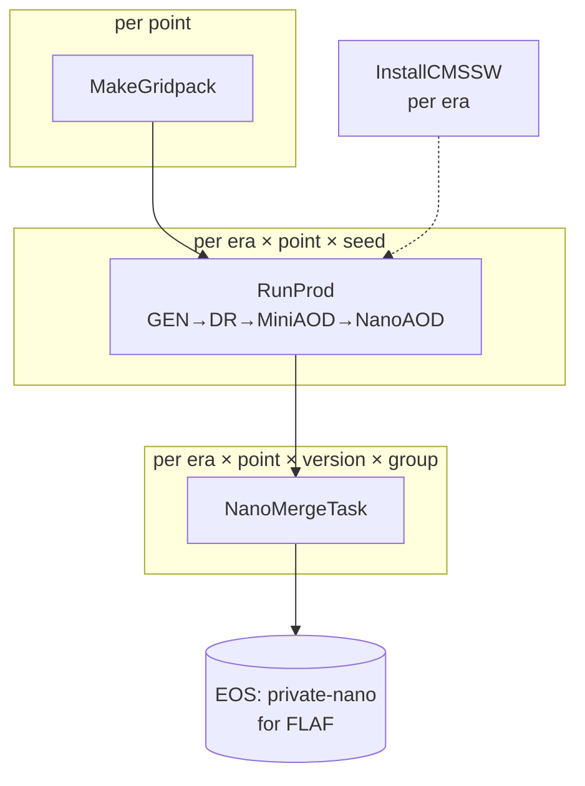

# Architecture

DSProd is a single linear production chain, generic over the physics process. This page explains
how the pieces fit together; the [tasks page](tasks.md) documents each task in detail.

## The production chain



- **`ImportGridpack`** copies a gridpack the DSProdGridpacks store already has to `fs_default`;
  it is always local, since reading the store needs git + Git LFS.
- **`MakeGridpack`** generates the gridpacks nothing else can provide, from cards via
  `genproductions_scripts`.
- **`RunProd`** runs the fused CMSSW chain (`LHEGS → DIGIPremixHLT → RECO → MiniAOD → NanoAOD`)
  for one `(era, point, seed)`, and stages one NanoAOD file per requested version.
- **`NanoMergeTask`** `hadd`s a group of per-seed nanos into one file, verifies the merged event
  count matches the sum of its inputs, and deletes the staged inputs.
- **`InstallCMSSW`** builds the CMSSW releases an era needs; it runs locally and its output is
  reused by the batch jobs.

## Generic tasks, process-specific modules

The tasks never mention a physics process directly. Instead each process ships a small
**customization module** — a `ProcessCustomization` subclass — that knows how to:

- expand a compact process configuration into concrete **points** (e.g. a mass scan);
- obtain the **gridpack** for a point (import an existing one, or describe how to generate it);
- render the CMSSW **gen fragment** for a point/era.

A [production setup](../configuration/prod-setups.md) selects one module by its `process:` key.
The models live in a separate submodule, [DSProdModels](https://github.com/cms-flaf/DSProdModels)
(mounted at `models/`, imported as the `models` package); DSProd's registry
(`dsprod/registry.py`) imports it to discover all registered plugins, and the interface lives in
`dsprod/processes/base.py`. Adding a new physics process is therefore a matter of
[writing one module](../configuration/processes.md) — plugin plus its cards/fragment — in
DSProdModels; the task graph is untouched.

Gridpacks are kept under version control in a second submodule,
[DSProdGridpacks](https://gitlab.cern.ch/cms-flaf/DSProdGridpacks) (mounted at `gridpacks/`, on
CERN GitLab, Git LFS). It is checked out sparsely — only the provenance `README.md` files — and a gridpack is
fetched from it on demand; `CollectGridpacks` is the way back, copying newly produced gridpacks
into the checkout for committing. See [Tasks](tasks.md).

## Per-era conditions

Everything that varies by era — CMSSW releases, `SCRAM_ARCH`, global tags, pileup inputs, the
list of production steps — lives in [`config/conditions_Run3.yaml`](../configuration/conditions.md),
sourced from the CMS McM public API. `dsprod/run_step.py` resolves the effective parameters for
each step by layering the defaults, the per-step defaults, the per-era block, and the per-era
per-step overrides.

## Storage layout

Products are written to `<fs_default>/<output>` — the file system from the
[user config](../configuration/settings.md) plus the setup's `output` — via LAW WLCG targets. The
final merged NanoAOD follows the private-nano (HLepRare) convention that FLAF consumes directly:

```
<fs_default>/<output>/
├── gridpacks/<gridpack-name>/gridpack.tar.xz
├── staging/nanoAOD_<version>/<era>/<point>/nano_<version>_<seed>.root   (removed after merge)
└── nanoAOD_<version>/<era>/<point>/nano_<version>_<group>.root          (final, for FLAF)
```

`<point>` is the point's `name` — the DAS name of the sample it reproduces — and `<gridpack-name>`
carries the production mode (`GluGlutoRadiontoHH_M-800`), because this level is flat: the
process/generator/energy/mode directories of the
[gridpack store](https://gitlab.cern.ch/cms-flaf/DSProdGridpacks) are not repeated here.

One file system serves every backend, so `--workflow local`, `htcondor` and `crab` write to
exactly these paths; CRAB's own stageout is disabled (see [Backends](backends.md)).

!!! note "`--test` writes elsewhere"
    A run with `--test <n>` replaces `<output>` by **`<output>_test`** for the event products, so a
    check can never overwrite a production sample. Gridpacks are the exception — they do not depend
    on the number of events, so they stay in the production area and a test reuses them.

### Local bookkeeping

Everything that is not a product stays in the checkout, under `$ANALYSIS_DATA_PATH` (`data/`):

```
data/<TaskClass>/<setup>/          law job files, CRAB PSet + code tarball, InstallCMSSW flags,
                                   CollectGridpacks reports
```

The directory gains a suffix when `--points` or `--test` narrow the run
(`<setup>_<selection><hash>_test<n>`), because both renumber the branches and law keys its control
files by branch range — two differently-scoped runs must not share job data. CMSSW releases live
outside it, in `soft/<CMSSW_VERSION>/`.

All remote I/O goes through DSProd's own gfal-CLI file interface
(`dsprod/grid_tools.py` + `law_gfal.py` + `law_wlcg.py`), ported from FLAF. It shells out to the
`gfal-*` command-line tools rather than the `gfal2` Python module, which is what lets the same
code write to EOS from a CRAB worker, where the Python module is unavailable.
