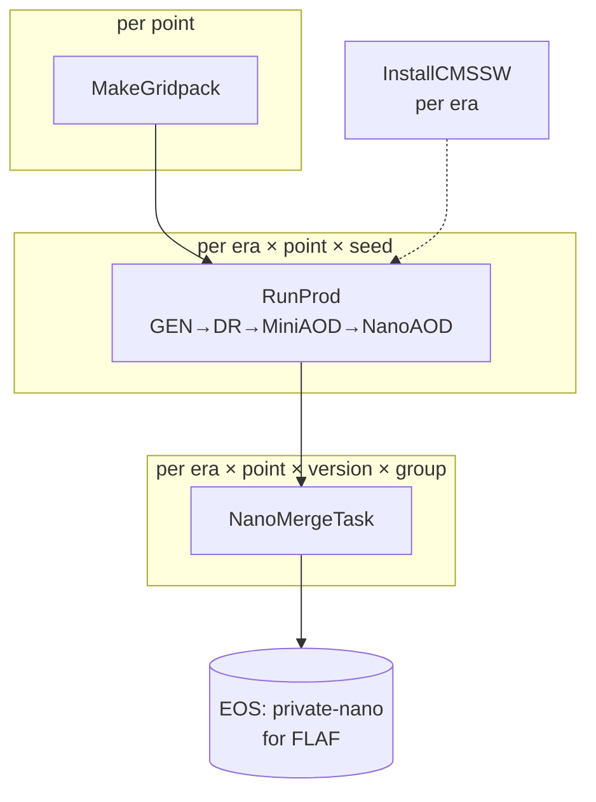

# Architecture

DSProd is a single linear production chain, generic over the physics process. This page explains
how the pieces fit together; the [tasks page](tasks.md) documents each task in detail.

## The production chain



- **`MakeGridpack`** provides the gridpack for each point — either *imported* from an existing
  tarball (a central gridpack on cvmfs or EOS) or *generated* from cards via
  `genproductions_scripts`.
- **`RunProd`** runs the fused CMSSW chain (`LHEGS → DIGIPremixHLT → RECO → MiniAOD → NanoAOD`)
  for one `(era, point, seed)`, and stages one NanoAOD file per requested version.
- **`NanoMergeTask`** `hadd`s a group of per-seed nanos into one file, verifies the merged event
  count matches the sum of its inputs, and deletes the staged inputs.
- **`InstallCMSSW`** builds the CMSSW releases an era needs; it runs locally and its output is
  reused by the batch jobs.

## Generic tasks, process-specific modules

The tasks never mention a physics process directly. Instead each process ships a small
**customization module** — a `ProcessCustomization` subclass — that knows how to:

- expand a compact process configuration into concrete **points** (e.g. a mass scan);
- obtain the **gridpack** for a point (import an existing one, or describe how to generate it);
- render the CMSSW **gen fragment** for a point/era.

A [production setup](../configuration/prod-setups.md) selects one module by its `process:` key.
Adding a new physics process is therefore a matter of
[writing one module](../configuration/processes.md) plus its cards/fragment templates — the task
graph is untouched. See the registry in `dsprod/registry.py` and the interface in
`dsprod/processes/base.py`.

## Per-era conditions

Everything that varies by era — CMSSW releases, `SCRAM_ARCH`, global tags, pileup inputs, the
list of production steps — lives in [`config/conditions_Run3.yaml`](../configuration/conditions.md),
sourced from the CMS McM public API. `dsprod/run_step.py` resolves the effective parameters for
each step by layering the defaults, the per-step defaults, the per-era block, and the per-era
per-step overrides.

## Storage layout

Products are written to the setup's `storage:` root (an EOS path) via LAW WLCG targets. The
final merged NanoAOD follows the private-nano (HLepRare) convention that FLAF consumes directly:

```
<storage>/
├── gridpacks/<point>/gridpack.tar.xz
├── staging/nanoAOD_<version>/<era>/<point>/nano_<version>_<seed>.root   (removed after merge)
└── nanoAOD_<version>/<era>/<point>/nano_<version>_<group>.root          (final, for FLAF)
```

All remote I/O goes through DSProd's own gfal-CLI file interface
(`dsprod/grid_tools.py` + `law_gfal.py` + `law_wlcg.py`), ported from FLAF. It shells out to the
`gfal-*` command-line tools rather than the `gfal2` Python module, which is what lets the same
code write to EOS from a CRAB worker, where the Python module is unavailable.
