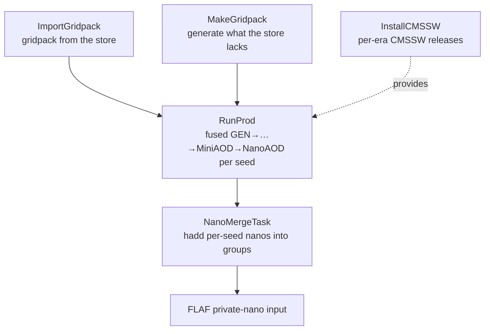

# DSProd

**DSProd** is a small [LAW](https://github.com/riga/law)-based tool for **custom CMS Monte
Carlo production** inside the [FLAF](https://github.com/cms-flaf/FLAF) ecosystem. It takes a
physics process from a **gridpack** all the way to analysis-ready **NanoAOD**, running the
standard CMSSW generation chain for the relevant Run3 era, and stages the output where FLAF
can pick it up directly.

It exists for samples that are **not** available in central CMS production — private signal
points, extra mass scans, alternative generator settings — but which still have to match the
central per-era conditions (global tags, pileup, CMSSW releases) so they can be analysed
side by side with the central samples.

!!! note "Scope"
    DSProd is deliberately much smaller than FLAF. It is one linear production chain
    (gridpack → NanoAOD) with a handful of tasks, generic over the physics process. Everything
    process-specific lives in a small [process customization module](configuration/processes.md);
    the tasks themselves stay generic.

## The big picture

A production is described by a single [**production setup** YAML](configuration/prod-setups.md)
(which process, which eras, which NanoAOD versions, which points). LAW then builds only the
steps needed to produce the requested output:



Each box is a LAW **task**. You normally run only the last task you care about — LAW pulls in
everything upstream automatically. Every task can run on three
[backends](concepts/backends.md): **local**, **HTCondor** (CERN batch), or **CRAB** (the WLCG
grid, for large productions).

## How the output feeds FLAF

`NanoMergeTask` writes merged NanoAOD following the private-nano (HLepRare) convention that FLAF
already understands:

```
<fs_default>/<output>/nanoAOD_<version>/<era>/<process-point>/nano_<version>_<n>.root
```

So once a production finishes, its samples are consumed by FLAF as ordinary NanoAOD inputs — no
extra bookkeeping step.

## Where to go next

- **[Installation](getting-started/installation.md)** — clone the repo and source the environment.
- **[Your first production](getting-started/first-production.md)** — run the bundled test setup
  end to end.
- **[Architecture](concepts/architecture.md)** — the production chain and how the pieces fit.
- **[Production setups](configuration/prod-setups.md)** — the YAML that describes a production.
- **[Driving a long production](operations/long-productions.md)** — the log, the lock, the
  credential clocks and the staleness alarm for a multi-day run.
- **[Contributing](contributing.md)** — code style and the formatting check.
